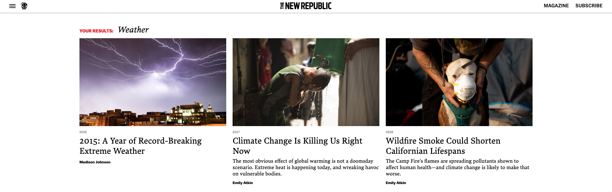
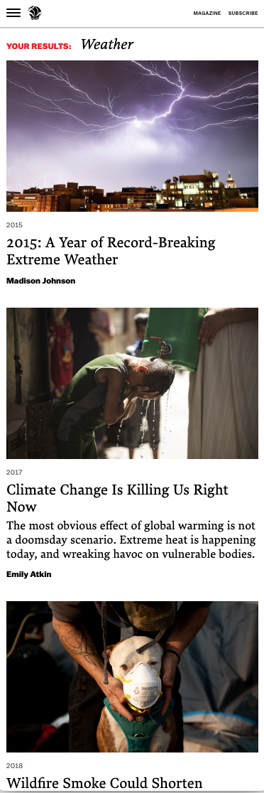
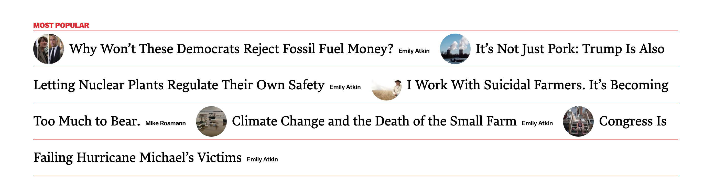
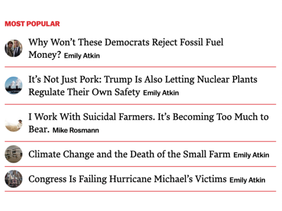

#####

# Questions:

* What are the exact detailed assets for font-family, font-size, responsiveness breakpoint, and the layout measurements? 

* What features do/will users utilize the most?

* Which browsers and versions do the users utilize the most?

* What is the primary function of the hamburger menu? 

* Where should the search input box be located? 

# Assumptions:

* It is top priority to create a working webpage that looks exactly like the given assignment. 

* I assumed that the search input box needs to be hidden based on the given assignment image. I'm guessing the hamburger menu would display anchor tags and the search input. For this code challenge, the hamburger icon is used to hide and display the search input box, but in a real life scenario, I would discuss this further before proceeding; it doesn't seem clear to the users.

* Another top priority is mobile-responsive functionality.

* I assumed font-family, font-size, responsiveness breakpoint, max width at 600px, and the layout measurements for this code challenge, but with more detailed info the product will look more similar to the given image.

* By practicing the single responsibility principle, additional components were added to separate the responsibilities of the `Search` component.

* React-Router will be used for navigation.

* The image size ratio is set at 3/2 to display identical size.

* `Your Results` and `Most Popular` texts are hidden if there are no articles shown as results.

* For the `Search` component, I would personally choose the functional component, using react hooks and utilizing useState/useEffect to update the search input. However, since this feature already works, I focused on other priorities. 

* `article.slug` has been used for image alt-text.

#####

# Code Challenge
Welcome to the code challenge part of the application process for TNR.

## Instructions
We want you to spend 2-4 hours on this, and you might not finish all of the features in that time. We'd prefer to see 
fewer finished features rather than many half-finished features. See below for priorities. 

We're also looking for well-organized code, and a good looking result. And we'd like to see how you think about coding. 
So, document your process, any questions you had, and any assumptions that you made.

## The Task
Your challenge is to build and style React components for our new search page. Here are the assets from the designer (these are not actually from our designer):

### The top 3 results should look like this:

   
### The rest of the results should look like this:

Notice that there are desktop designs, and mobile designs. Please take this starter app and implement the designs. You can 
see the code for the current search results widget [here](src/Search.js). 

We recommend you spend between 2-4 hours on this and go ahead and send us the result. Please also add to this readme any 
questions you would want to ask, and the assumptions you made.

# Docs from CRA:

This project was bootstrapped with [Create React App](https://github.com/facebook/create-react-app).

## Available Scripts

In the project directory, you can run:

### `yarn start`

Runs the app in the development mode. 
Open [http://localhost:3000](http://localhost:3000) to view it in the browser.

The page will reload if you make edits. 
You will also see any lint errors in the console.

### `yarn test`

Launches the test runner in the interactive watch mode. 
See the section about [running tests](https://facebook.github.io/create-react-app/docs/running-tests) for more information.

### `yarn build`

Builds the app for production to the `build` folder. 
It correctly bundles React in production mode and optimizes the build for the best performance.

The build is minified and the filenames include the hashes. 
Your app is ready to be deployed!

See the section about [deployment](https://facebook.github.io/create-react-app/docs/deployment) for more information.

### `yarn eject`

**Note: this is a one-way operation. Once you `eject`, you can’t go back!**

If you aren’t satisfied with the build tool and configuration choices, you can `eject` at any time. This command will remove the single build dependency from your project.

Instead, it will copy all the configuration files and the transitive dependencies (Webpack, Babel, ESLint, etc) right into your project so you have full control over them. All of the commands except `eject` will still work, but they will point to the copied scripts so you can tweak them. At this point you’re on your own.

You don’t have to ever use `eject`. The curated feature set is suitable for small and middle deployments, and you shouldn’t feel obligated to use this feature. However we understand that this tool wouldn’t be useful if you couldn’t customize it when you are ready for it.

## Learn More

You can learn more in the [Create React App documentation](https://facebook.github.io/create-react-app/docs/getting-started).

To learn React, check out the [React documentation](https://reactjs.org/).

### Code Splitting

This section has moved here: https://facebook.github.io/create-react-app/docs/code-splitting

### Analyzing the Bundle Size

This section has moved here: https://facebook.github.io/create-react-app/docs/analyzing-the-bundle-size

### Making a Progressive Web App

This section has moved here: https://facebook.github.io/create-react-app/docs/making-a-progressive-web-app

### Advanced Configuration

This section has moved here: https://facebook.github.io/create-react-app/docs/advanced-configuration

### Deployment

This section has moved here: https://facebook.github.io/create-react-app/docs/deployment

### `yarn build` fails to minify

This section has moved here: https://facebook.github.io/create-react-app/docs/troubleshooting#npm-run-build-fails-to-minify
